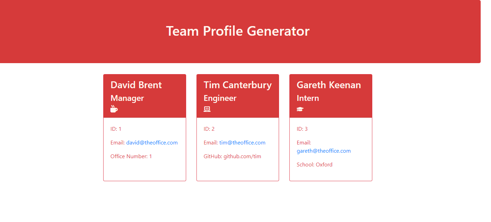
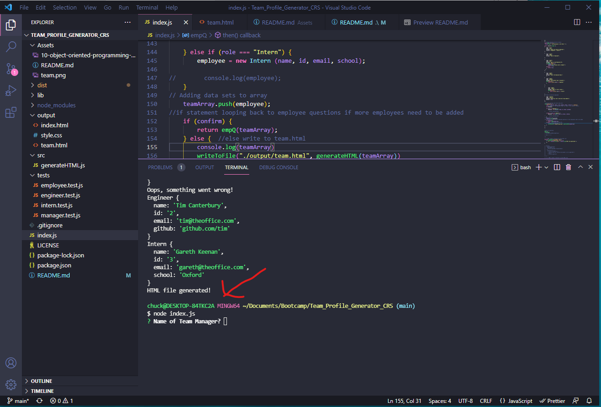

# Team Profile Generator
## Description:
 > This app uses Node.js to generate a Team Profile web page for a web development team. 
 >
## License: 
 > 
## Table of Contents:

- [Installation](https://github.com/chuck2076/Team_Profile_Generator_CRS/tree/main/output#installation)
- [Usage](https://github.com/chuck2076/Team_Profile_Generator_CRS/tree/main/output#usage)
- [Contributors](https://github.com/chuck2076/Team_Profile_Generator_CRS/tree/main/output#contributors)
- [Tests](https://github.com/chuck2076/Team_Profile_Generator_CRS/tree/main/output#tests)
- [Questions](https://github.com/chuck2076/Team_Profile_Generator_CRS/tree/main/output#questions)
## Installation:
 > The user should clone the repository and open in preferred coding terminal. User will also need to install the Jest NPM for testing and Inquirer NPM for the question prompts.
## Usage:
 > Open index.js in the terminal and type node index.js at the command prompt. Follow the command prompts to add information and create a "team.html" page.
 > 
 ## Video: 
 > Watch a short video on how to use the Team Profile Generator [Team Profile Video](https://drive.google.com/file/d/1g3sBRRxBy5ubPMcpiEC1quq0Cnxza7UB/view)
## Tech Stack:
 > * Node.js 
 > * Inquirer NPM  
 > * Jest NPM  
 > * JavaScript
 > * HTML
 > * CSS  
## Contributors:
 > [https://github.com/chuck2076](https://github.com/chuck2076)
## Tests:
 >Tests can be found here: [https://github.com/chuck2076/Team_Profile_Generator_CRS/tree/main/tests](https://github.com/chuck2076/Team_Profile_Generator_CRS/tree/main/tests) Run npm test from the command line to test the files.
## Questions:
 Chuck Stephens 
 [https://github.com/chuck2076](https://github.com/chuck2076) 

Feel free to get in touch! 
 [chuckstephens2076@gmail.com](mailto:chuckstephens2076@gmail.com)
